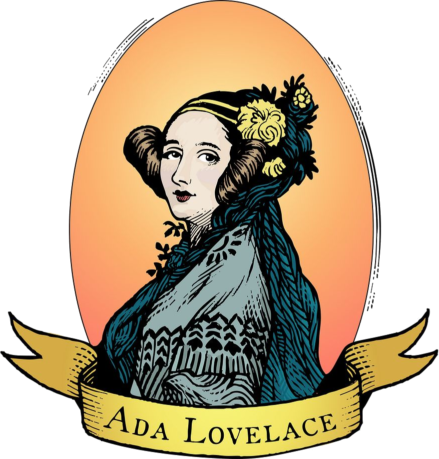

# Ada Lovelace: A Historical Record

Ada Lovelace (1815–1852) was an English mathematician and writer, known for her work on Charles Babbage’s Analytical Engine, an early mechanical computer. She is often called the first computer programmer because she understood that machines could do more than just calculate numbers.

She was born Augusta Ada Byron, the daughter of the poet Lord Byron and Anne Isabella Milbanke. Her father was famous for his poetry, but her mother encouraged her to study mathematics and logic to keep her focused and disciplined.

With guidance from leading mathematicians of her time, Ada combined careful thinking with imagination, which allowed her to write work that was far ahead of her time.

## The First Computer Programmer

Ada’s most famous work was her set of notes on Babbage’s Analytical Engine, which she wrote after translating a memoir by the Italian mathematician Luigi Menabrea. Her notes, labeled Notes A to G, explained how the machine worked and how it could be used.

She saw that the Analytical Engine could do more than arithmetic. While Babbage thought of it mainly as a calculator, Ada imagined it could handle symbols and even create music or graphics.

In her notes, she included a method for calculating Bernoulli numbers with the Engine, which is considered the first published algorithm written for a machine.

She also suggested that the machine could process anything that could be represented with symbols, an idea that became the basis for modern computing.

## Mathematics and Imagination

Ada was skilled in algebra, calculus, and logic, learning ideas that would later be important in programming.

She also had imagination, thinking about ways computers could do more than just number crunching, like making patterns in music or art.

Her careful step-by-step methods showed how a machine could carry out complex instructions, which is the idea behind all modern programs.

## Historical Impact and Legacy

The Analytical Engine was never built in Ada’s lifetime, but her ideas influenced later mathematicians and engineers. In 1980, the U.S. Department of Defense named the Ada programming language after her.

She is remembered as the first programmer, someone who saw the full potential of computers long before they existed, and as a person who combined careful thinking with imagination.

## Approximate Timeline

1815 – Born in London, England 
1828–1832 – Studied mathematics and logic with tutors including Mary Somerville and Augustus De Morgan 
1833 – Met Charles Babbage and began working on the Analytical Engine 
1842–1843 – Translated Menabrea’s memoir and wrote her notes, including the first algorithm 
1852 – Died at age 36 in London 

Today, every time we write code, run a program, or use a computer for music or art, we are using ideas Ada Lovelace first imagined.
